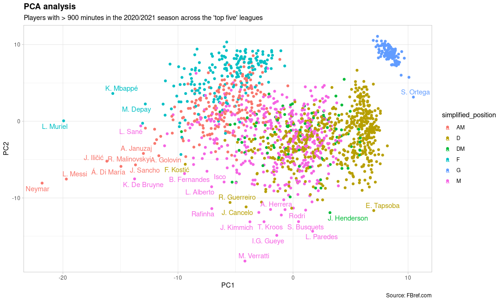

# Football player analysis tool

The purpose of this repo is to "scout" football players to find similar style players. The repo uses data from the 2020/2021 season in the "top 5" leagues. The source of the data is <https://www.kaggle.com/goaltergeist/tidy-fbref-2021-player-data-credit-ronanmann>, which is a tidy version of the data sourced from FBref.com.

The algorithm uses per 90 data in PCA and UMAP to reduce the dimensionality of the data. The euclidean distance is then calculated to find the most similar players. The repo also hosts a basic shiny app to explore the data

